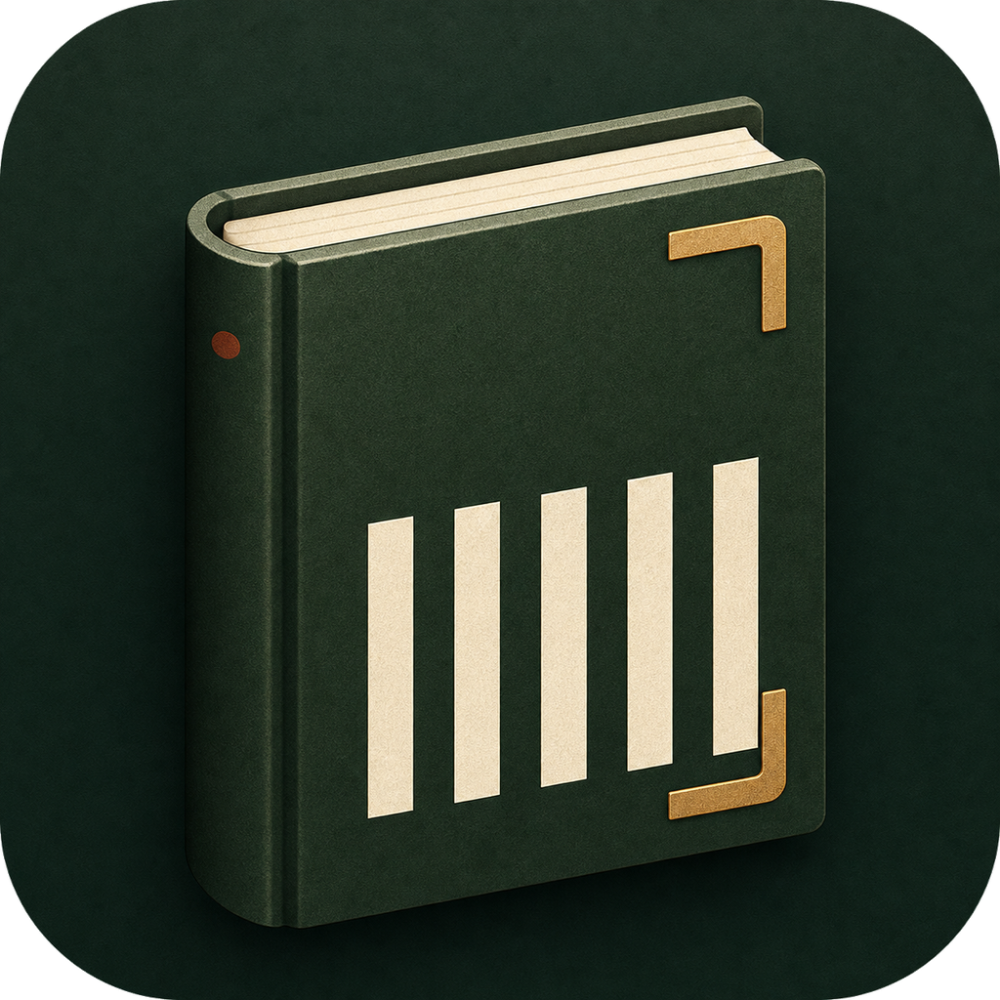
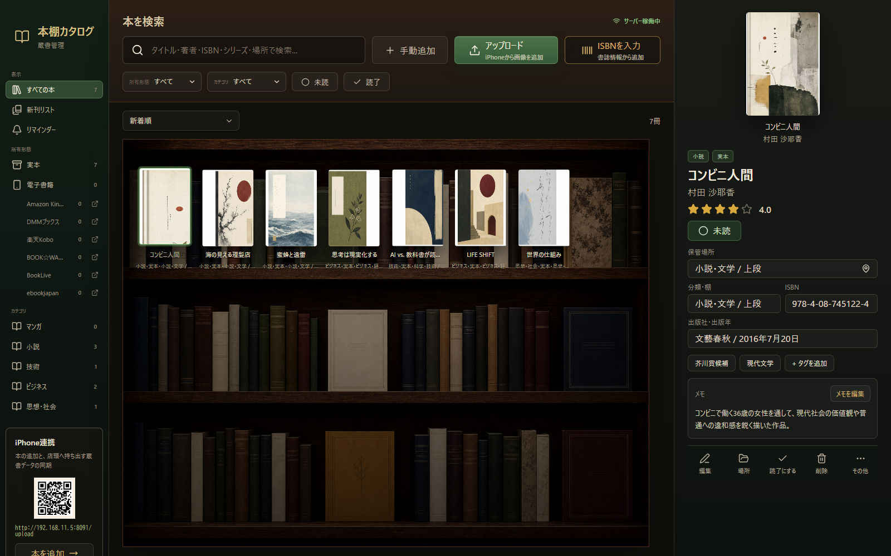
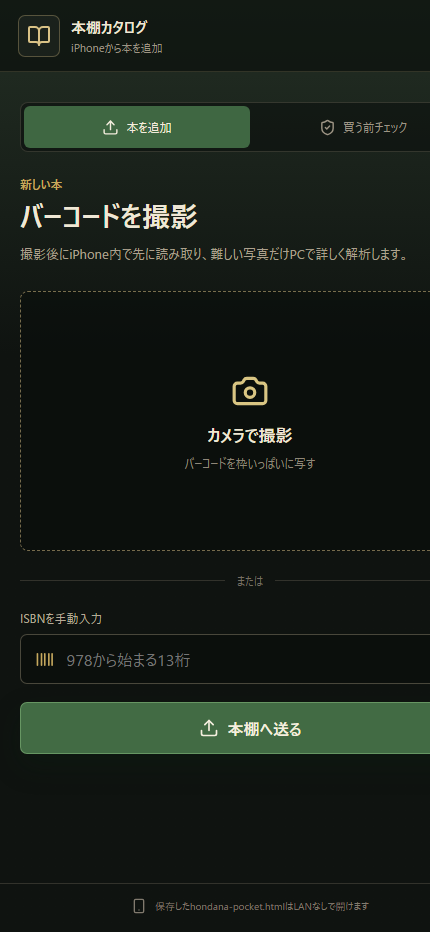

<p align="center">
  
</p>

<h1 align="center">本棚カタログ</h1>

<p align="center">
  Windows PCを本棚サーバーにして、同じLAN内のiPhoneから本を登録できる個人向け蔵書管理アプリです。
</p>

<p align="center">
  
  
  
  
  
  
  
</p>

## ダウンロード

[GitHub Releases](https://github.com/tmd-0x5a/hondana-catalog/releases/latest) から `Hondana-Catalog-Portable-0.2.0.exe` をダウンロードしてください。

- インストール不要のWindows x64向けポータブル版です。
- EXEを起動すると、ブラウザとは別のアプリウィンドウで開きます。
- 現在の配布EXEは商用コード署名証明書を使用していないため、Windows SmartScreenが確認を表示する場合があります。配布元とファイル名を確認してから実行してください。
- Windows Defender ファイアウォールの確認では、iPhone連携に使う場合のみ「プライベート ネットワーク」を許可してください。

## スクリーンショット

### PCの本棚画面



### iPhoneのLANアップロード画面

<p align="center">
  
</p>

## 主な機能

- ISBNバーコードをiPhoneで撮影し、同じLAN内のPCへ登録
- ISBNの直接入力と、タイトル・著者・ISBNによる書籍候補検索
- 書誌情報と表紙画像の自動取得、PC内への表紙キャッシュ
- 実本と電子書籍を分けて管理し、保管場所や電子書籍ストアのリンクを保存
- マンガ、小説、技術書、ビジネス書などのカテゴリ絞り込み
- シリーズ名と巻数の管理、新刊候補リスト、アプリ内リマインダー
- 名前、著者、シリーズ、保管場所、新着順による並べ替え
- ドラッグ操作による手動並べ替え
- 本屋で重複購入を防ぐための、iPhone向け持ち出し本棚HTML
- 蔵書データ、写真、表紙をPCへローカル保存

## 使い方

### PCだけで登録する

1. 「手動追加」でタイトルを検索するか、「ISBNを入力」を選びます。
2. 候補を選択すると、タイトル、著者、出版社、ISBN、表紙などを補完します。
3. 所有形態、カテゴリ、保管場所、読了状態などを設定します。

### iPhoneから登録する

1. PCとiPhoneを同じWi-Fiへ接続します。
2. PC画面左下の「iPhone連携」にあるQRコードを読み取ります。
3. 「本を追加」でISBNバーコードを撮影するか、13桁のISBNを入力します。
4. 「本棚へ送る」を押すとPC側へ登録されます。

バーコードが読みにくい場合は、バーコードを画面いっぱいに写し、反射や影を避けてください。iPhone側で先に高速解析し、必要な場合だけPC側で高精度解析します。

### 本屋へ持ち出す

1. iPhoneの「買う前チェック」を開きます。
2. PCと同じLAN内で「出発前に同期」を押します。
3. 「持ち出し保存」から `hondana-pocket.html` をiPhoneへ保存します。
4. 店頭では保存したHTMLを開き、タイトル、著者、ISBNで所蔵を確認します。

持ち出しHTMLには作成時点の蔵書が埋め込まれるため、PCやインターネットへ接続せずに確認できます。

## データの保存とバックアップ

アプリのデータは次のフォルダーへ保存されます。

```text
%APPDATA%\HondanaCatalog\data
```

蔵書一覧、アップロード写真、表紙キャッシュが含まれます。アプリを終了してからこの `data` フォルダーを別の場所へコピーするとバックアップできます。ポータブルEXEを更新しても、このフォルダーは上書きされません。

このリポジトリでは `data/`、`release/`、一時キャッシュをGit管理から除外しています。個人の蔵書や写真はソースコードへ含まれません。

## 使用技術

| 区分 | 技術 | 用途 |
| --- | --- | --- |
| 言語 |  | フロントエンド、APIサーバー、デスクトップ処理 |
| UI |  | 本棚、検索、編集画面 |
| ビルド |  | 開発サーバーとフロントエンドビルド |
| デスクトップ |  | Windowsアプリ化とローカルサーバーの起動 |
| API |   | LANアップロード、書籍検索、ローカル保存 |
| バーコード | `@zxing/browser` / `@zxing/library` | iPhone写真とPC側フォールバックによるISBN解析 |
| 画像処理 | `sharp` | アップロード画像の回転、切り抜き、縮小 |
| 配布 | `electron-builder` | Windows x64ポータブルEXEの生成 |

## 書籍情報と表紙の取得元

ISBNや検索語を使い、次の外部サービスから取得できた情報を組み合わせます。

- openBD: 日本語書籍の書誌情報と表紙候補
- Google Books API: 書誌情報と表紙候補の補完
- 国立国会図書館サーチ: タイトル検索、新刊候補、表紙候補
- Open Library Covers API: 表紙画像のフォールバック

取得後の表紙はPC内へキャッシュします。外部サービスの停止、仕様変更、登録漏れなどにより、情報や表紙を取得できない場合があります。取得結果の正確性は保証されないため、重要な情報は元の書籍でも確認してください。表紙画像や書誌情報の権利は、それぞれの権利者・提供元に帰属します。

## 開発

開発時のみNode.js 24以上とnpmを用意し、リポジトリのフォルダーで実行します。配布EXEを使う場合、Node.jsのインストールは不要です。

```powershell
npm install
npm run desktop
```

フロントエンドとAPIサーバーを分けて起動する場合は、別々のターミナルで実行します。

```powershell
npm run server
npm run dev
```

Windows向けポータブル版を作成します。

```powershell
npm run dist:win
```

生成物は `release/` に出力されます。

## プライバシーと安全上の注意

- 蔵書データ、写真、表紙キャッシュはPCへ保存され、クラウド同期は行いません。
- 書誌情報や表紙を取得するときは、ISBNや検索語が外部APIへ送信されます。
- LAN用画面には利用者認証がないため、自宅など信頼できるプライベートネットワーク内だけで使用してください。
- ルーターのポート開放や、インターネットへの直接公開は行わないでください。
- 本アプリは自動バックアップを行いません。必要に応じて `data` フォルダーをバックアップしてください。
- 新刊リストは外部データから作る候補です。発売状況や版の違いは書店・出版社でも確認してください。

## 既知の制約

- 現在の配布物はWindows x64向けです。
- 新刊確認、候補検索、初回の表紙取得にはインターネット接続が必要です。
- リマインダーはアプリ内表示で、OS通知やメール通知には対応していません。
- 外部APIに情報がない本、ISBNがない同人誌・PDF・EPUBなどは手動登録が必要です。

## ライセンスと免責

このソフトウェアは [MIT License](LICENSE) で提供します。改変、再配布、商用利用が可能ですが、著作権表示とライセンス表示を残してください。

本ソフトウェアは「現状のまま」提供され、動作、正確性、特定目的への適合性などを保証しません。本ソフトウェアの使用または使用不能によって生じたデータ消失、購入間違い、通信上の問題、その他の損害について、作者および著作権者は責任を負いません。正式な条項は `LICENSE` の英文を確認してください。
