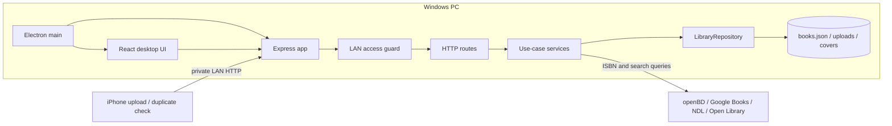

# アーキテクチャ

本棚カタログは、ElectronがPC上でExpress APIを起動し、同じUIをデスクトップとLAN内のiPhoneへ配信する構成です。クラウドサーバーや外部データベースは使いません。

## 責務

| 場所 | 責務 |
| --- | --- |
| `electron/main.mjs` | 単一起動、ユーザーデータの保存先、ローカルサーバー、ウィンドウと外部リンクの管理 |
| `server/index.mjs` | 保存先と各サービスを組み立て、HTTPサーバーを起動するComposition Root |
| `server/app.mjs` | Expressミドルウェア、静的配信、共通エラー形式の構成 |
| `server/routes/` | HTTPの入力とステータスをサービス呼び出しへ変換する薄いルート層 |
| `server/request-validation.mjs` | HTTP入力の許可項目、型、長さ、列挙値、URL、配列上限の検証 |
| `server/security/` | LANトークン、Host・IP・Origin検査、セキュリティヘッダー、レート制限 |
| `server/image-validator.mjs` | アップロード画像の実体形式、容量、画素数、静止画検査 |
| `server/book-service.mjs` | 蔵書の作成・更新・削除、ISBN書誌の取り込み、表紙補完 |
| `server/book-bulk-import-service.mjs` | ISBN・手動書誌の最大200件一括処理、所有形態反映、行単位の失敗分離 |
| `server/series-service.mjs` | 所持巻と刊行巻の比較、シリーズ追跡結果の保存 |
| `server/recommendation-service.mjs` | 読了・評価済み蔵書の選定、著者別候補、所蔵済み除外 |
| `server/upload-service.mjs` | 画像保存、解析状態、アップロード履歴、ISBN確定 |
| `server/library-repository.mjs` | `books.json`と`uploads.json`の保存境界、初期データ作成 |
| `server/book-metadata-service.mjs` | openBDとGoogle Booksの書誌統合 |
| `server/ndl-catalog-service.mjs` | NDL候補検索、シリーズ巻検索、XML変換、短期キャッシュ |
| `server/cover-service.mjs` | 表紙候補の取得、画像検証、WebP変換、ローカルキャッシュ |
| `server/barcode-scanner.mjs` | 画像領域の段階探索、ZXing解析、ISBN検証 |
| `server/http-client.mjs` | 外部HTTP通信のタイムアウトとUser-Agent統一 |
| `server/book-model.mjs` | 保存データの既定値、カテゴリ・巻数・シリーズ名の純粋な正規化 |
| `server/isbn.mjs` | ISBNの整形、検証、ISBN-10からISBN-13への変換 |
| `server/offline-library.mjs` | 店頭へ持ち出す自己完結HTMLの安全な生成 |
| `src/DesktopLibrary.jsx` | PC本棚の状態、API操作、各独立ビューの調停 |
| `src/components/` | 本棚、詳細フィルター、表示設定、一括取り込み、シリーズ詳細、おすすめの表示責務 |
| `src/library-model.js` | 検索・絞り込み・並び替え・棚見出し・シリーズ表示モデルの純粋関数 |
| `src/bulk-import-model.js` | ISBN一覧とタブ区切り書誌をAPI入力へ変換する純粋関数 |
| `src/library-preferences.js` | 本の大きさ、見出し、シリーズ集約のlocalStorage境界 |
| `src/MobileUpload.jsx` | iPhone撮影、端末内バーコード解析、LAN送信、持ち出し本棚 |
| `src/api.js` | JSON APIの共通エラー処理 |
| `src/types.js` | JSDocで共有するBook、Upload、Series、Filterのデータ契約 |

## データの流れ

1. Electronが `%APPDATA%\HondanaCatalog\data` を保存先としてExpressを起動します。
2. PCとiPhoneのUIはファイルを直接触らず、すべてHTTP API経由で更新します。LAN側はQRの起動時トークンで認証します。
3. ISBNは保存前に13桁へ正規化し、同じISBNの再登録は所蔵情報を残した更新として扱います。
4. 表紙は外部URLのままにせず、取得できた画像をWebPへ変換して `covers/` に保存します。
5. iPhone写真は端末内で先に解析し、失敗時だけ元画像をPCへ送り、より広い探索を行います。

## 守るべき前提

- `applyBookDefaults` は古い保存データとの互換入口です。項目追加時はここにも既定値を追加します。
- カテゴリは「保存済みの有効値」「旧データのマンガ分類」「名前付きキーワード規則」の順で決定します。
- 状態や外部依存を持つ処理はクラスへ集約し、文字列変換や判定は副作用のない関数として残します。
- Expressルートには書誌統合、保存形式、画像解析などの業務判断を書きません。
- 信頼できないHTTP入力は`request-validation.mjs`または画像検査を通過するまでサービス・外部API・保存層へ渡しません。
- JSONの読込・変更・保存はファイル単位の更新トランザクションとして直列化し、一時ファイルから置換します。直前の正常な内容は `.bak` に残し、主ファイルのJSONが壊れた場合に読み戻します。
- UIの検索・並び替え規則は `library-model.js` に集約し、Reactコンポーネント内へ重複させません。
- 持ち出しHTMLは外部スクリプトを読み込まず、埋め込みJSONのscript終端を必ずエスケープします。
- `normalizeIsbn` を通していないISBNを保存キーや重複判定に使いません。
- 外部APIの一部が失敗しても、ISBNだけで登録を継続できる状態を保ちます。
- 読了状態、保管場所、電子媒体、メモ、手動並び順は書誌情報の再取得で失わないようにします。
- LAN APIは起動時トークンを要求してもHTTP通信です。信頼できるプライベートネットワーク専用とし、インターネットへ直接公開しません。

## 関連文書

- [要件定義書](REQUIREMENTS.md)
- [機能仕様書](FUNCTIONAL-SPEC.md)
- [画面仕様書・画面遷移図](SCREEN-SPEC.md)
- [DB設計書](DATA-DESIGN.md)
- [API仕様書](API-SPEC.md)
- [セキュリティ設計](SECURITY.md)
