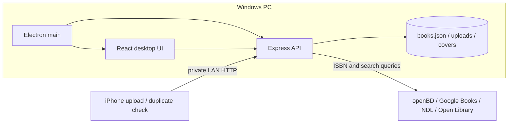

# アーキテクチャ

本棚カタログは、ElectronがPC上でExpress APIを起動し、同じUIをデスクトップとLAN内のiPhoneへ配信する構成です。クラウドサーバーや外部データベースは使いません。

## 責務

| 場所 | 責務 |
| --- | --- |
| `electron/main.mjs` | 単一起動、ユーザーデータの保存先、ローカルサーバー、ウィンドウと外部リンクの管理 |
| `server/index.mjs` | HTTP API、画像アップロード、書誌統合、表紙キャッシュ、シリーズ確認 |
| `server/isbn.mjs` | ISBNの整形、検証、ISBN-10からISBN-13への変換 |
| `server/book-model.mjs` | 保存データの既定値、カテゴリ・巻数・シリーズ名の正規化 |
| `server/library-store.mjs` | `books.json`と`uploads.json`の保存境界、初期データ作成 |
| `server/offline-library.mjs` | 店頭へ持ち出す自己完結HTMLの安全な生成 |
| `src/DesktopLibrary.jsx` | PC本棚の状態、編集、新刊操作、アップロード通知と画面構成 |
| `src/library-model.js` | 検索・絞り込み・並び替え・シリーズ集約の純粋関数 |
| `src/MobileUpload.jsx` | iPhone撮影、端末内バーコード解析、LAN送信、持ち出し本棚 |
| `src/api.js` | JSON APIの共通エラー処理 |

## データの流れ

1. Electronが `%APPDATA%\HondanaCatalog\data` を保存先としてExpressを起動します。
2. PCとiPhoneのUIはファイルを直接触らず、すべてHTTP API経由で更新します。
3. ISBNは保存前に13桁へ正規化し、同じISBNの再登録は所蔵情報を残した更新として扱います。
4. 表紙は外部URLのままにせず、取得できた画像をWebPへ変換して `covers/` に保存します。
5. iPhone写真は端末内で先に解析し、失敗時だけ元画像をPCへ送り、より広い探索を行います。

## 守るべき前提

- `applyBookDefaults` は古い保存データとの互換入口です。項目追加時はここにも既定値を追加します。
- UIの検索・並び替え規則は `library-model.js` に集約し、Reactコンポーネント内へ重複させません。
- 持ち出しHTMLは外部スクリプトを読み込まず、埋め込みJSONのscript終端を必ずエスケープします。
- `normalizeIsbn` を通していないISBNを保存キーや重複判定に使いません。
- 外部APIの一部が失敗しても、ISBNだけで登録を継続できる状態を保ちます。
- 読了状態、保管場所、電子媒体、メモ、手動並び順は書誌情報の再取得で失わないようにします。
- LAN APIは信頼できるプライベートネットワーク専用です。インターネットへ直接公開しません。

## 次のリファクタリング候補

1. `server/index.mjs` から、書誌プロバイダー、表紙キャッシュ、バーコード解析、シリーズ検索、ルート定義を順番に分離する。
2. `library-store.mjs` に一時ファイルを使ったアトミック保存とバックアップを追加する。
3. `DesktopLibrary.jsx` から編集モーダル、詳細ペイン、新刊ビュー、検索状態をコンポーネントとカスタムHookへ分離する。
4. API結合テストとElectron E2Eテストを追加する。
5. ESLintとフォーマッターを導入し、GitHub Actionsで `npm test` と `npm run build` を実行する。
