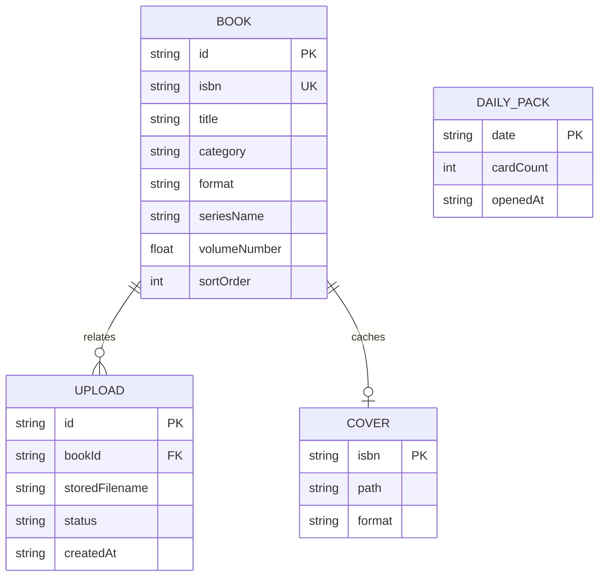

# DB設計書（ローカルJSONストア）

## 1. 採用方式

本アプリはRDBMSを使用せず、単一利用者・単一PC向けのJSONファイルを永続化層とする。`LibraryRepository`を唯一の読書き境界とし、UIやサービスからファイルを直接操作しない。

| 環境 | 保存先 |
| --- | --- |
| 配布EXE | `%APPDATA%\HondanaCatalog\data` |
| 開発 | `HONDANA_DATA_DIR`またはリポジトリの`data/` |

## 2. 物理構成

```text
data/
  books.json          蔵書配列
  books.json.bak      直前の正常な蔵書
  uploads.json        アップロード履歴配列
  uploads.json.bak    直前の正常な履歴
  uploads/            iPhoneから受信した写真
  covers/             ISBN名のWebP表紙キャッシュ
  backups/            起動日ごとの蔵書スナップショット（books-YYYY-MM-DD.json、最新7世代）
  daily-pack.json     その日のおすすめカードパック
```

## 3. 論理モデル



ER図は関連と主要項目を示す簡略図である。`id`の旧数値互換、ISBN・外部キーの任意性、`number/null`などの正確な保存契約は、以下の項目表を正とする。

## 4. BOOK項目

| 項目 | 型 | 必須 | 制約・用途 |
| --- | --- | --- | --- |
| id | string/number | 必須 | 新規はUUID。数値は旧データ互換 |
| title | string | 必須 | 1〜300文字 |
| titleReading | string | 任意 | 最大300文字。名前順と行見出しへ優先使用 |
| author | string | 必須 | 最大300文字。未取得時は「著者情報なし」 |
| authorReading | string | 任意 | 最大300文字。著者順と行見出しへ優先使用 |
| isbn | string | 任意 | 保存時はISBN-13。手動本は空文字可。実質一意 |
| publisher | string | 任意 | 最大200文字 |
| published / pages | string | 任意 | 表示用書誌 |
| category | enum | 必須 | マンガ、小説、技術、ビジネス、思想・社会、実用、その他 |
| bookType | enum | 必須 | `manga` / `book`。旧データ互換 |
| format | enum | 必須 | `physical` / `electronic` |
| physicalLocation | string | 任意 | 実本の場所。最大300文字 |
| electronicPlatform | string | 任意 | 電子媒体。最大100文字 |
| electronicUrl | string | 任意 | 認証情報を含まないHTTPS URL、最大2048文字 |
| shelf | string | 任意 | 利用者定義分類、最大200文字 |
| tags | string[] | 必須 | 最大30件、各1〜50文字 |
| status | enum | 必須 | 未読 / 読了 |
| rating | number | 必須 | 0〜5 |
| note | string | 任意 | 最大5000文字 |
| seriesName | string | 任意 | 最大300文字 |
| volumeNumber | number/null | 任意 | 0.1〜10000 |
| reminderDate | string | 任意 | 空文字または実在するYYYY-MM-DD |
| reminderNote | string | 任意 | 最大500文字 |
| coverUrl | string | 任意 | 原則`/covers/{isbn}.webp` |
| uploadedImageUrl | string | 任意 | `/uploads/{server-generated-name}` |
| metadataCheckedAt | string | 任意 | 表紙・読み補完の最終試行日時。3日間隔の再試行判定に使う |
| sortOrder | number | 必須 | 手動順の昇順キー |
| createdAt / updatedAt | string | 必須 | ISO 8601 |
| series* / nextVolume* | scalar | 任意 | 最終確認日時、最新巻、次巻のスナップショット |

## 5. UPLOAD項目

| 項目 | 型 | 必須 | 制約・用途 |
| --- | --- | --- | --- |
| id | string | 必須 | UUID |
| originalName | string | 必須 | basename化、制御文字除去、最大120文字 |
| storedFilename | string | 必須 | サーバー生成名。利用者入力をパスに使わない |
| imageUrl | string | 必須 | アプリ内画像URL |
| status | enum | 必須 | processing / needs_isbn / success |
| message | string | 必須 | 画面通知 |
| isbn / bookId | string | 任意 | 完了時の蔵書との関連 |
| createdAt / completedAt / dismissedAt | string | 任意 | ISO 8601 |

履歴は最大100件をJSONへ保持する。成功通知は完了後60秒まで表示する。

## 5A. DAILY_PACK項目

その日のおすすめカードパックを1件だけ保持する。蔵書ではなく表示用の一時データとして扱う。

| 項目 | 型 | 必須 | 制約・用途 |
| --- | --- | --- | --- |
| date | string | 必須 | ローカル日付のYYYY-MM-DD。日付が変わると作り直す |
| cards | object[] | 必須 | 最大5件。`isbn`、`title`、`author`、`publisher`、`published`、`coverUrl`、`description`、`url`、`genre`、`rare`、`reason` |
| openedAt | string/null | 必須 | 開封日時のISO 8601。未開封はnull |

同じ日の再表示では外部APIを呼ばず、このファイルの内容をそのまま返す。BOOKレコードとは独立しており、削除しても蔵書に影響しない。

## 6. 整合性・移行・復旧

- `applyBookDefaults`が古いレコードへ既定値を追加し、カテゴリ・媒体表記を正規化する。
- ISBN登録では正規化ISBNの一致を確認し、既存レコードを更新する。
- JSONの読込・変更・保存は`updateBooks` / `updateUploads`の更新トランザクションとしてファイル単位で直列化し、PC編集とiPhone登録の同時更新を失わない。
- 完成した一時ファイルだけを主ファイルへ置換する。
- 置換前に主ファイルが正常JSONなら`.bak`へコピーする。主ファイル破損時は`.bak`を読む。
- `.bak`は一世代だけの破損対策であり、誤操作対策として起動日ごとの蔵書スナップショットを`backups/`へ最新7世代保持する。
- `GET /api/export/books`で蔵書全件をJSONとしてダウンロードできる。いずれも利用者による`data/`フォルダーの外部バックアップを代替しない。
- 単一プロセス前提。将来RDBMSへ移行する場合も、サービスから見える保存契約は`LibraryRepository`で維持する。

本の大きさ、棚見出し、シリーズ集約は端末固有の表示設定としてlocalStorageへ保存し、BOOKレコードには含めない。
