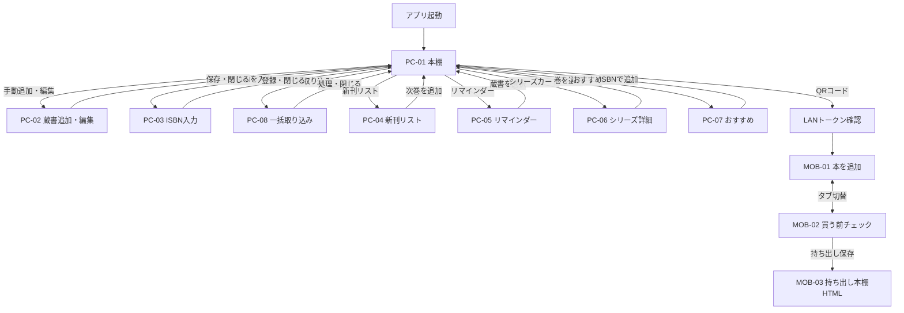

# 画面仕様書・画面遷移図

## 1. 画面一覧

| ID | 画面 | 対象 | 主な役割 |
| --- | --- | --- | --- |
| PC-01 | 本棚 | Windows | 検索、絞り込み、並び替え、蔵書一覧、詳細、LAN QR |
| PC-02 | 蔵書追加・編集モーダル | Windows | 候補検索、所蔵・分類・シリーズ・リマインダー編集 |
| PC-03 | ISBN入力モーダル | Windows | ISBNからの即時登録 |
| PC-04 | 新刊リスト | Windows | シリーズ一括確認、次巻表示・登録 |
| PC-05 | リマインダー | Windows | 日付設定済み蔵書と期限到来表示 |
| PC-06 | シリーズ詳細 | Windows | 集約カードから所持巻を巻数順に表示 |
| PC-07 | おすすめ | Windows | 読了・評価をもとに未所持候補を表示・登録 |
| PC-08 | 一括取り込みモーダル | Windows | スクリーンショットOCR候補またはISBN・TSV/TXTから一括登録 |
| MOB-01 | 本を追加 | iPhone | 撮影、端末内解析、画像送信、ISBN手動補完 |
| MOB-02 | 買う前チェック | iPhone | 蔵書同期、撮影・文字検索による重複確認 |
| MOB-03 | 持ち出し本棚HTML | iPhone | PC・LAN不要のオフライン検索 |

## 2. 画面遷移

## 3. PC-01 本棚

### 構成

- 左サイドバー: すべて、新刊、リマインダー、実本、電子書籍・媒体、カテゴリ、iPhone連携QR。
- 上部: 現在ビュー名、サーバー状態、検索、追加ボタン、絞り込み、期限・新刊通知。
- 中央: 表紙付き蔵書一覧。シリーズは重なりカード、手動順では各巻をドラッグ可能。
- 右詳細: 表紙、書誌、カテゴリ、所有形態、場所・媒体、シリーズ、リマインダー、タグ、メモ、操作。

### 状態

| 状態 | 表示 |
| --- | --- |
| 読込中 | 一覧更新中の操作を抑制する |
| 空一覧 | 条件に一致する蔵書がない旨を表示する |
| API停止 | サーバー状態をオフライン表示する |
| iPhone処理中 | 画像解析、ISBN入力待ち、成功を通知領域へ表示する |
| 狭い画面 | 1480px以下では詳細をオーバーレイ化し、900px・780pxでサイドバーと操作列を段階的に縮める |

表示設定は本の大きさ、棚見出し、シリーズ集約を変更する。棚見出しは棚上の「仕切り」ボタンからも即時に表示・非表示を切り替える。詳細フィルターは出版社、著者、最低評価、シリーズ有無を扱う。

## 4. PC-02 蔵書追加・編集

- 必須: タイトル。
- 基本: 著者、ISBN（新規のみ）、出版社、出版日、カテゴリ。
- 所蔵: 実本/電子、物理場所、電子媒体、HTTPSリンク、棚。
- 読書: 未読/読了、タグ、メモ。
- シリーズ: シリーズ名、巻数。マンガ選択時に表示する。
- リマインダー: 日付、内容。
- タイトル2文字以上で候補を表示し、候補選択後も利用者入力の所蔵項目を優先する。

## 5. PC-04・PC-05

- 新刊リストはシリーズ単位の行とし、所持最大巻、確認済み最新巻、次巻、刊行日、登録操作を表示する。
- リマインダーは通常一覧レイアウトを使い、日付のある蔵書だけを表示する。当日以前は強調する。

## 5A. PC-08 一括取り込み

- 左サイドバーに「電子書籍を登録」「実本を取り込む」を常設し、棚上の操作からも開ける。
- 実本・電子書籍、保管場所または電子媒体、取り込み方法を表示する。電子書籍ではスクリーンショット方式を初期選択する。
- スクリーンショットは最大12枚を複数選択でき、OCR後はチェック、表紙、書名、著者、出版年、代替候補を一覧表示する。
- 一覧方式はISBNのみ、`タイトル<TAB>著者`、`ISBN<TAB>タイトル<TAB>著者`とTSV/TXTを受け付ける。
- 処理中は再送信を抑止し、完了後は新規・更新・失敗件数と失敗行を表示する。

## 5B. PC-06・PC-07

- シリーズ詳細は本棚へ戻る操作、シリーズ名、所持冊数、巻数順の一覧を表示する。巻選択で同じ画面の詳細ペインを開く。
- おすすめは選定理由、書名、著者、出版社、NDL書誌リンク、ISBN追加操作を表示する。候補がない場合は読了・評価を促す空状態を表示する。

## 6. MOB-01 本を追加

- 上部に「本を追加」「買う前チェック」のタブを配置する。
- 撮影入力、プレビュー、ISBN入力、送信ボタンを表示する。
- 状態は`idle`、`scanning`、`detected`、`working`、`needs_isbn`、`success`、`error`を取り得る。
- 成功メッセージは6秒後に消し、次の撮影を妨げない。

## 7. MOB-02・MOB-03

- MOB-02は同期日時、同期操作、持ち出し保存、文字検索、撮影検索、重複結果を表示する。
- localStorageには店頭確認に必要な最小項目だけを保存する。
- MOB-03は単一HTMLとして、蔵書数、保存日時、検索欄、最大50件の結果、ISBN完全一致警告を表示する。

## 8. 共通表示規則

- 主要操作はアイコンと日本語ラベルを併記する。
- APIの4xxメッセージは入力付近、全体処理は通知領域へ表示する。
- 外部URLは新しい既定ブラウザで開き、Electron画面内へ読み込まない。
